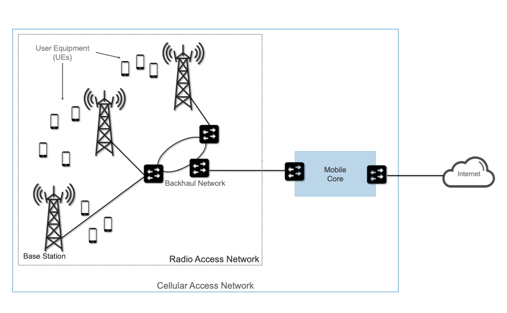
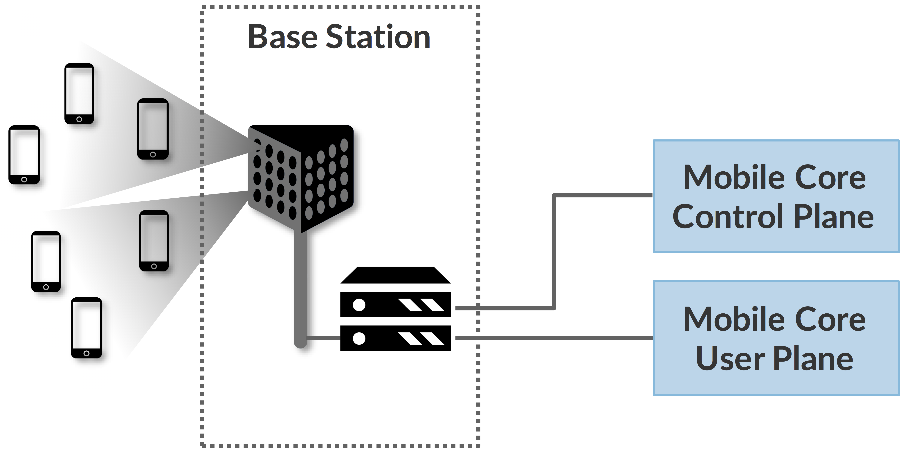
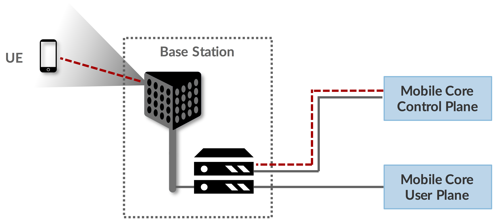
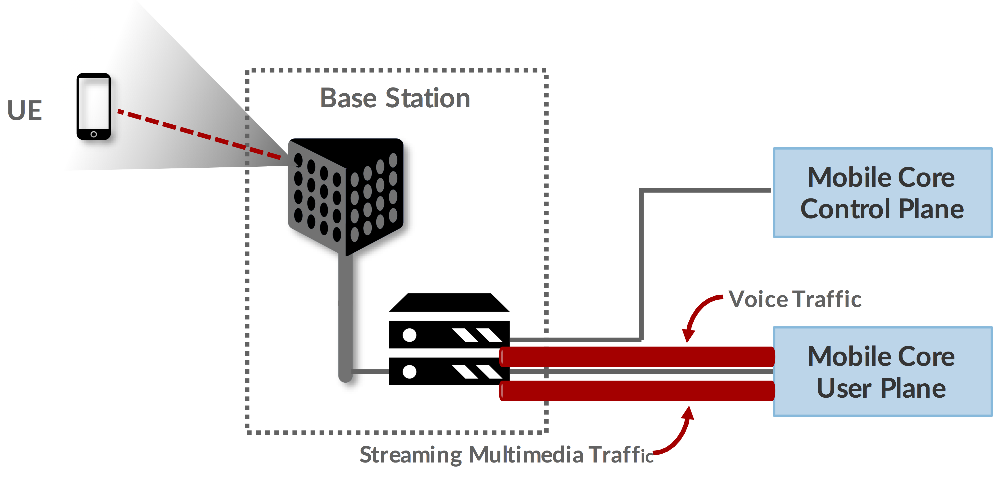
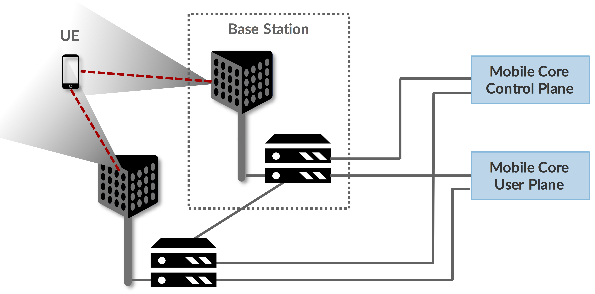
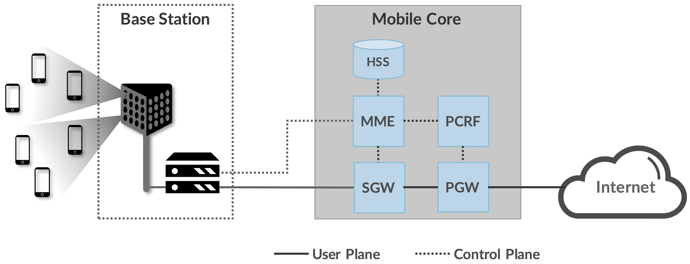
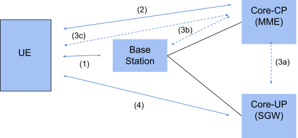

## Chapter 1 Overview and Learning Objectives

This chapter will review the main components and architecture of 4G/LTE/5G mobile networking. It is not intended to be exhaustive, but will give you enough background to enable you to understand Magma, which implements the functionality of a Mobile Core. If you are already familiar with 4G or 5G, this chapter is just a quick review of main concepts. If you are new to these technologies, you may want to go deeper, for which we recommend the following resource: 5G Mobile Networks: A Systems Approach, by Larry Peterson and Oguz Sunay.

By the end of this chapter you should:

* Be familiar with the functions of the **Radio Access Network (RAN)** and the Mobile Core (sometimes called the **Evolved Packet Core**, or **EPC**).
* Understand the separation between the **User Plane** and the **Control Plane**, and the primary functions of each.

## Video: Rural Communities Use Case (Martin Casado)

In this video, Martin Casado discusses **why cellular is required to bring Internet access to remote areas**, and how this is driving Magma adoption. He discusses the work of MuralNet, which is a non-profit organization delivering broadband access to Native American communities in the U.S. They chose Magma to implement their cellular access service.

## Standardization Landscape

Cellular network standards have for many years been set by the 3rd Generation Partnership Project (3GPP). Even though its name has "3G" in it, the 3GPP continues to define the standards for 4G and 5G, each of which corresponds to a sequence of releases of the standard. **Release 15** is considered the demarcation point between 4G and 5G, with Release 17 scheduled for 2021. Complicating the terminology, 4G was on a multi-release evolutionary path referred to as Long Term Evolution (LTE). LTE and 4G are sometimes used interchangeably; in other cases, LTE refers to technologies that were on the evolutionary path towards "true" 4G.

Magma largely **abstracts out** the differences between all the various cellular network standards–indeed, that is one of its strengths–but it is important to realize that these various standards exist and have certain differences.

## Spectrum Allocation

Like Wi-Fi, cellular networks transmit data at certain bandwidths in the radio spectrum. Unlike Wi-Fi, which permits anyone to use a channel at either 2.4 or 5 GHz (these are unlicensed bands), governments have auctioned off and licensed exclusive use of various frequency bands to service providers, who in turn sell mobile access service to their subscribers.

The specific frequency bands that are licensed for cellular networks vary around the world, and are complicated by the fact that network operators often simultaneously support both old/legacy technologies and new/next-generation technologies, each of which occupies a different frequency band.

While the specific frequency band is not directly relevant to understanding Magma from an architectural perspective, it does impact the physical-layer components, which in turn has indirect ramifications on the overall system. We identify and explain these ramifications in later chapters. Ensuring that the allocated spectrum is used efficiently is also a critical design goal for cellular networks.

## Cellular Architecture Overview

**High-level cellular network architecture**

The cellular network consists of two main subsystems: the Radio Access Network (RAN) and the Mobile Core (called the Evolved Packet Core or EPC in 4G). User Equipment (UE) is the term for devices that connect to the network, including mobile phones and other equipment such as routers with cellular interfaces.

The RAN manages the radio spectrum, making sure it is used efficiently and meets the quality-of-service (QoS) requirements of every user. It corresponds to a distributed collection of base stations, connected by a backhaul network to the Mobile Core.

The Mobile Core is a bundle of functionality (as opposed to a device) that serves several purposes:

1. Provides Internet (IP) connectivity for both data and voice services.
2. Ensures this connectivity fulfills the promised QoS requirements.
3. Tracks user mobility to ensure uninterrupted service.
4. Tracks subscriber usage for billing and charging.

## Control and User Plane Separation (CUPS)

**Control and User Plane separation in the RAN and Mobile Core**

The RAN consists of a set of base stations connected to the mobile core. Base stations connect to user equipment (UE)–mobile phones or other cellular devices. The Mobile Core is partitioned into a Control Plane and User Plane, which is similar to the **control/data plane split** that someone familiar with the Internet would recognize. 3GPP uses the term **CUPS–Control and User Plane Separation**—to denote this idea.

The User plane carries data or voice information, while the Control plane is responsible for functions such as identifying subscribers, determining what services they are entitled to, and tracking usage for billing purposes.

Closely related to the concept of the Control plane is signalling. Signalling messages are exchanged among control plane devices and UEs in order to establish a user path channel. We will see some examples of signalling in the discussion of authentication and mobility on the next pages.

## Radio Access Network (RAN) Overview

**A RAN is implemented by a set of interconnected base stations**

As shown in the figure above, a base station comprises an antenna (or a set of them) which handles all the radio-specific communication functions, such as modulation of signals in the appropriate frequency range. It also contains computational capabilities (illustrated here as a pair of servers) to perform the functions described in the next section.

Base stations in 4G - these are (somewhat cryptically) named **eNodeB (or eNB)**, which is short for **evolved Node B**. In 5G, they are known as **gNB** (the g stands for "next Generation").

## RAN Functions

A useful way to understand the RAN is to look at how a single base station reacts to the arrival of a new UE (user equipment, such as a mobile phone). First, a base station establishes the wireless channel for a subscriber’s UE upon power-up or upon handover from another station.

Second, the base station establishes Control Plane connectivity between the UE and the Mobile Core, and forwards signaling traffic between the two. This signaling traffic enables UE authentication, registration, and mobility tracking.

Third, for each active UE, the base station establishes one or more tunnels to the Mobile Core User Plane component, as illustrated below.

**Tunnels for the User Plane from Base Station to Mobile Core**

At this stage, the base station is able to forward both control and user plane packets between the Mobile Core and the UE.

Each base station coordinates UE handovers with neighboring base stations, using direct station-to-station links. Base stations can also receive multi-path transmissions from a UE, as illustrated below.

**A UE may be served by two base stations at one time**

## Mobile Core Overview

**Major functional blocks of the Mobile Core**

The image above shows the main functional blocks of a 4G mobile core, also known as the Evolved Packet Core (EPC). In 5G, the Mobile Core is called NG-Core, for Next Generation.

Across the various generations of 3GPP architecture, there is some variation in the names of the functional blocks, but the primary functions are consistent.

Note that the mobile core functions include both **user plane components (SGW and PGW)** and **control plane components (HSS, MME, PCRF)**. We’ll look a little more closely at these components in the next section.

## Mobile Core Main Components (4G)

The 4G Mobile Core, also known as the Evolved Packet Core (EPC), consists of five main components, the first three of which run in the Control Plane (CP) and the second two of which run in the User Plane (UP):

* **MME (Mobility Management Entity)**
	Tracks and manages the movement of UEs throughout the RAN. This includes recording when the UE is not active.
* **HSS (Home Subscriber Server)**
	A database that contains all subscriber-related information.
* **PCRF (Policy & Charging Rules Function)**
	Tracks and manages policy rules and records billing data on subscriber traffic.
* **SGW (Serving Gateway)**
	Forwards IP packets to and from the RAN. Anchors the Mobile Core end of the bearer service to a (potentially mobile) UE, and so is involved in handovers from one base station to another.
* **PGW (Packet Gateway)**
	Essentially an IP router, connecting the Mobile Core to the external Internet. Supports additional access-related functions, including policy enforcement, traffic shaping, and charging.

Although specified as distinct components, in practice, the **SGW (RAN-facing) and PGW (Internet-facing) are often combined in a single device**, commonly referred to as an S/PGW.

We will see how these components operate in the next section. Even though the component modularity and names change from 4G to 5G, the same functions exist in both generations.

## Mobile Core: Authentication

**Sequence of steps to establish secure channels for Core and User planes**

The following example illustrates some of the key functions of the mobile core.

The UE contains an operator-supplied SIM card, which uniquely identifies the subscriber and establishes the radio parameters (e.g., frequency band) needed to communicate with that operator’s Base Stations. **The SIM card also includes a secret key** that the UE uses to authenticate itself.

The UE communicates with a nearby Base Station over a temporary (unauthenticated) radio link (Step 1). The Base Station forwards the request to the Core-CP over an existing tunnel, and the Core-CP initiates an authentication protocol with the UE (Step 2). In 4G, the control plane component that performs this step is called the Mobility Management Entity (MME). This step authenticates the UE and the Mobile Core to each other.

The Core-CP informs the other components of the parameters they will need to service the UE (Step 3). This includes: (a) instructing the Core-UP to initialize the user plane (e.g., assign an IP address to the UE); (b) instructing the Base Station to establish an encrypted channel to the UE; and (c) giving the UE the symmetric key it will need to use the encrypted channel with the Base Station.

At this point, the UE can communicate with the User Plane of the mobile core over an encrypted channel (step 4). In 4G, the User Plane component to which the UE communicates is the SGW (Serving Gateway).

Steps 1 through 3 are all a form of **signaling**: the steps that take place **before a User Plane connection** can be established.

## Mobile Core: Mobility

Mobility of the UE is achieved by re-executing one or more of the steps discussed on the previous page.

As a UE moves around a RAN, it comes within range of multiple Base Stations. Based on the signal’s measured quality, the Base Stations communicate directly with each other to make a handover decision. Once made, the decision is then communicated to the Mobile Core, re-triggering the setup functions of step (3) on the previous page.

As a result, a new user plane connection is built between the UE and the Mobile Core. The Mobile Core’s user plane buffers data during the handover transition, avoiding dropped packets and subsequent end-to-end retransmissions.

In other words, the cellular network maintains the UE session in the face of mobility (corresponding to the control and data channels depicted by steps (2) and (4) on the previous page).

This is only possible when the **same Mobile Core** serves the UE, i.e., only the Base Station changes. This would typically be the case for a UE moving within a metropolitan area. Moving between metro areas—and hence, between Mobile Cores—is indistinguishable from power cycling a UE. The UE is assigned a new IP address and no attempt is made to buffer and subsequently deliver in-flight data.

Any UE that becomes inactive for a period of time also loses its session, with a new session established and a new IP address assigned when the UE becomes active again.

## Chapter 1 Summary

In this chapter, we have walked through the primary functions of the RAN (Radio Access Network) and Mobile Core. The RAN consists of interconnected base stations which handle the transmission and reception of radio signals to User Equipment (UE), such as mobile handsets.

Mobile networks separate the functions of User Plane and Control Plane. The User Plane is responsible for moving data and voice, while the Control Plane handles authentication, security, usage monitoring, and mobility management, among other functions.