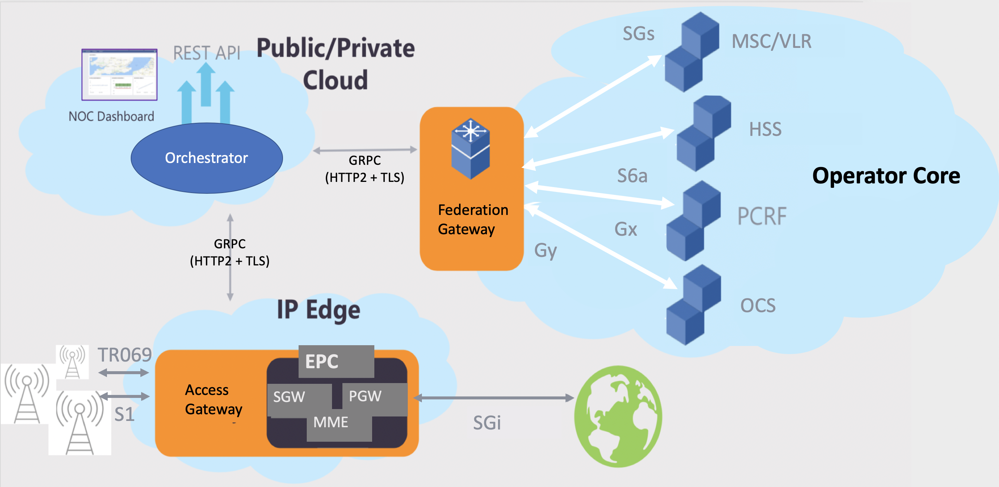
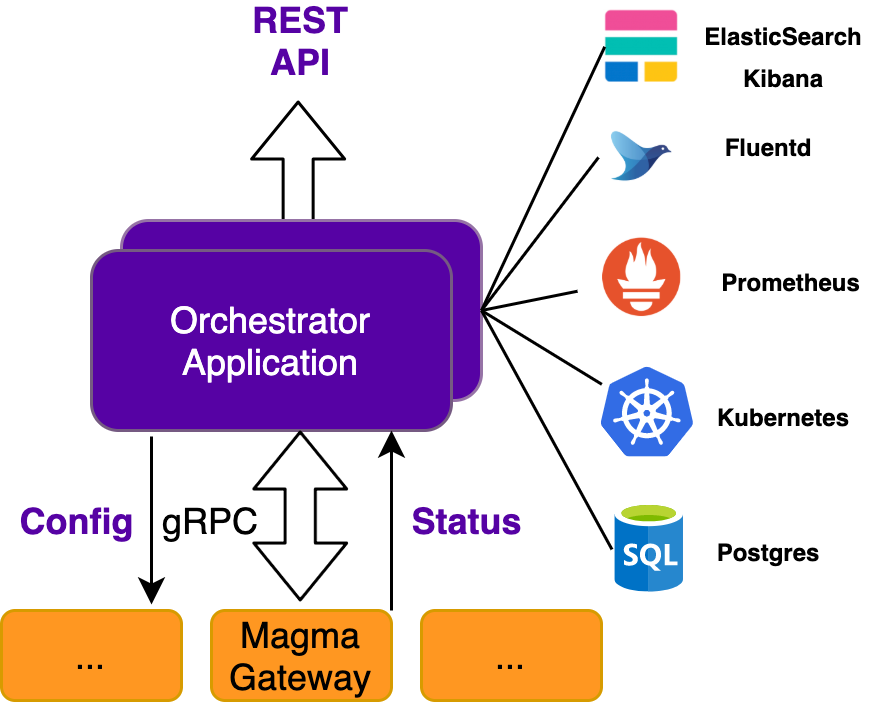

## Chapter 2 Overview and Learning Objectives

This chapter will introduce the main components of Magma:

* **The Access Gateway (AGW)**, which implements **user plane** and **mobility management** functions for a mobile packet core;
* **The orchestrator**, which provides a central point of **control and configuration** for the mobile core and interfaces with many other components;
* **The Federation Gateway (FGW)**, which allows Magma to extend and **interoperate with existing mobile networks**;
* **The Network Management System (NMS)**, which provides a graphical user interface **(GUI) for provisioning and operating Magma-based networks**.

It will also explain the underlying principles of the Magma architecture, which have guided the design and implementation. Magma differs from traditional implementations of 3GPP in a few important respects, particularly in the way it achieves independence of the radio access technology for most of the system.

By the end of this chapter you should:

* Be familiar with the main building blocks of Magma.
* Understand the key design principles of Magma.
* Discuss the main benefits of the Magma architecture for better reliability, scale, operations and heterogeneity.
* 

## Video: Magma Architecture (Amar Padmanabhan)

## Magma Goals

Magma aims to provide a mobile core networking solution that is:

* Cost-effective
* Scalable
* Manageable for operators providing network access in remote regions
* Reliable
* Compatible with existing 3GPP networks
* **Independent of underlying radio technology or spectrum** (4G/5G/WiFi/other)
* Able to address the heterogenous environments that mobile operators face.

## Architectural Principles

To achieve the goals laid out in the previous section, Magma applies a number of principles from modern cloud data center architecture to the mobile core architecture. These can be summarized as follows:

* **Separation of control plane and data plane**. Failure of a control plane element should not cause the data plane to fail, although it may prevent new data plane state from being created (e.g. bringing new UEs online).
* **Push data plane state to the edge**. As an example, per-UE state should not appear in the core of the network, but exists only at devices close to the edge (e.g. in an AGW close to the relevant UE). This results in a more scalable and fault tolerant implementation.
* **Store configuration state centrally, and runtime state at the edges**. This is the same approach as taken in Software-Defined Networking (SDN), for example.
* **Desired State configuration model**. APIs allow users to configure their intended state, while the control plane is responsible for ensuring that this state is realized.
* **Insulate the core network from the radio access network details**. 3GPP architectures have made different design choices in the mobile core for different generations of radio. Magma uses a **common core design** for all radio access technologies, including Citizens Band Radio Service (CBRS) and non-3GPP technologies such as WiFi.
* **Software-controlled data plane**. The data plane is programmed through well-defined and stable interfaces (similar in principle to OpenFlow) that are independent of hardware. Again, this is the same approach as taken in SDN.
* **Standard distributed systems techniques to communicate among components**. For example, the main components of Magma communicate with each other using **gRPC**, an open source Remote Procedure Call (RPC) framework.
* **Expect individual components to fail**. A failure of a component affects as few users as possible (i.e. fault domains are small) and doesn’t affect other components. The assumption that failure of components is normal and must be dealt with in the design is typical of cloud native applications, but not common in traditional telco architectures. This approach also has a positive impact on operations such as software upgrade.

While many of these might seem obvious, they are fairly different from the principles of the standard 3GPP architecture. For example, even though 3GPP has the concept of Control and User Plane Separation (CUPS), control plane elements often hold some user plane (data plane) state. A proper separation of control and data planes leads to a more robust architecture with better upgradability. As discussed next, **the term "control plane" has a subtly different meaning in Magma (and in SDN) than it does in standard telecommunications terminology**.

The effect of these design principles will become more clear as we walk through the architecture and implementation of Magma more closely.

The Magma architecture applies many of the principles of Software-Defined Networking (SDN) to the design of a mobile core. To learn more about SDN architecture, we recommend [Software-Defined Networks: A Systems Approach](https://sdn.systemsapproach.org/), by Larry Peterson, Carmelo Cascone, Brian O’Connor, Thomas Vachuska, and Bruce Davie. In particular, the chapter on [SDN architecture](https://sdn.systemsapproach.org/arch.html) and the section on [Network Virtualization](https://sdn.systemsapproach.org/uses.html#network-virtualization) are relevant to the Magma architecture.

## Magma Architecture Overview

An overview of the Magma architecture appears below. This diagram includes the **AGW**, **Orchestrator**, and **FGW**. It also shows a number of interfaces to components in the "operator core", which is relevant in the case where Magma is used to extend the operator’s existing mobile network. We will dig into the details of this diagram and those interfaces later.

**Magma High-Level Architecture**

**The Orchestrator is a cloud service that provides a simple, consistent, and secure way to configure and monitor the wireless network**. The Orchestrator can be hosted on a public/private cloud. The metrics acquired through the platform allow you to see the analytics and traffic flows of the wireless users through the **Magma web UI**. The Orchestrator implements a **centralized management plane**, as well as aspects of the control plane for Magma. More details on this are covered in the next section.

**The Access Gateway (AGW) implements the runtime features of the Evolved Packet Core (EPC)**: the SGW, PGW, and aspects of the MME. "Runtime" refers to those functions that are frequently changing due to events such as the powering on of a UE, consumption of usage quota, or a mobility event. **There are typically many AGWs for one Orchestrator, and a single AGW typically supports multiple base stations**.

**The Federation Gateway (FGW) terminates a number of standard interfaces to an existing mobile core and then communicates with the Orchestrator over gRPC**. This enables a Magma system to connect to and extend the existing mobile core, leveraging existing subscriber data, billing systems, and policies, for example.

There is a **fourth component to Magma** not shown here, the **NMS (network management system)** which we will discuss shortly.

## Management, Control, and Data Planes

In the previous chapter, we introduced the concept of the Control Plane and the User Plane, which are defined as part of the 3GPP specifications. In SDN systems, including Magma, it is common to use a slightly different set of terminology: management, control, and data planes. This is shown in the figure below.

**Management, Control, and Data Planes**

**The data plane is distributed, in the case of Magma, among a set of AGWs (and, optionally, one or more Federation Gateways)**. It concerns the forwarding of data packets and enforcement of policies. It maps fairly closely to the 3GPP User Plane. **The control plane is logically centralized**, and it decides how to make changes to the data plane to ensure that the desired state is actually realized. Note in the diagram that the control plane is gathering information from the data plane, e.g., learning about the new location of a UE. This is referred to as discovered state. When there is a discrepancy between the discovered state and the desired state, the control plane has the responsibility to decide how to resolve that discrepancy, e.g. by pushing some new information to some part of the data plane.

The management plane provides the single point of entry for both the input of configuration information and for the querying of status information such as metrics, alerts, etc. When configuration information is provided to the management plane via the northbound API, that updates the desired state.

The **desired state model** is a common pattern in cloud native systems. The control plane’s main job is to continuously reconcile the actual state of the system with the desired state, in the face of configuration changes, failures of components, or other events such as the arrival of new UEs.

Note that this is a logical view of the architecture, not a physical one. The control plane is logically centralized in the picture, but it is actually implemented in a hierarchical and distributed manner for reasons of availability, fault isolation, and scale. **Some parts of the control plane run centrally in the Orchestrator, while others are distributed out to the AGWs**. We refer to the part of the control plane that **runs in the orchestrator as the central control plane**, and the part **that runs in the AGW is the local control plane**.

Finally, note that the Control Plane of 3GPP is not the same as the Magma control plane. The 3GPP Control Plane is most easily understood as the signaling functions that allow a User Plane channel to be established. 3GPP does not really have a centralized state model and hence does not map directly onto the model just described.

## The Orchestrator (a.k.a orc8r)

**The Orchestrator provides the configuration interface for Magma via REST APIs**. It also integrates with a range of other systems to provide **FCAPS (fault, configuration, accounting, performance, security)** management capabilities (as they are known in the telco world). In the model just described, it implements the management plane for Magma. The Orchestrator also implements the centralized parts of the control plane for Magma. Based on the configuration information and observed (or discovered) state gathered from the network, it pushes instructions to the appropriate AGW that will be locally implemented.

**Orchestrator and its main interfaces**

The main points to note about the orchestrator are:

* **It is implemented as a highly available cloud service**. As shown in the above diagram, there is more than one instance of the service so that it can tolerate failure of an instance, and it can be scaled out with additional instances. These multiple instances operate as a single logically centralized control plane and API entry point.
* **The Orchestrator connects to other services** (shown on the right) to leverage capabilities like time-series data storage and relational database services.
* **A single Orchestrator connects to multiple Magma access gateways**.
* **gRPC** is used to convey status information from gateways to the Orchestrator, and to push configuration information to the gateways.

While an Orchestrator can be connected to other systems that provide the traditional telco functions of Operations Support and Billing Support (OSS/BSS), it can also be used on its own as a (fairly minimal) OSS/BSS for those operators who do not have existing OSS/BSS to connect with. This is most commonly the case for small greenfield operators.

**The Orchestrator implements the desired state model** mentioned previously: the user inputs desired state (e.g., a certain subscriber should have access to the network with a certain quota) and the Orchestrator ensures that the desired state is realized by pushing updates to the appropriate gateways. There is a continuous loop of attempting to reconcile the realized state with the desired state.

To understand the split between the Orchestrator and the AGW, it is helpful to distinguish between **configuration state** and **runtime state**. Configuration state will be provided by an operator, e.g., adding a set of policies relating to a subscriber. Runtime state is generated by real-time activities such as the powering on of a UE or a mobility handoff from one base station to another.

## Access Gateway (AGW)

**The Access Gateway (AGW) provides the runtime functionality of an EPC**. These functions include (in the case of 4G) User Plane functions SGW, PGW, and Control Plane function MME. There are typically a few Base Stations per Access Gateway, and multiple AGWs per Orchestrator. Additional AGWs can be added to scale out the overall network as required.

**High level view of Access Gateway**

**The AGW reports runtime state to the Orchestrator, which in turn pushes configuration commands to the AGW**. For example, the AGW is responsible for generating encryption keys (runtime state) so that a UE can securely communicate with the mobile core, while the Orchestrator is responsible for configuring the policy (config state) that allows a UE to connect to the network in the first place.

## Federation Gateway (FEG)

**The Federation Gateway integrates an existing Mobile Network Operator (MNO) core network with Magma** by using standard 3GPP interfaces to existing MNO components. It acts as **a proxy between the Magma AGW and the operator's network**. This enables core functions, such as authentication, data plans, policy enforcement, and charging to stay uniform between an existing MNO network and the expanded network with Magma.

The FEG also keeps the Magma network well insulated from the specific details of a given generation of 3GPP technology, as the FGW converts between specific 3GPP protocols and the radio-technology-independent implementations of Magma.

## Network Management System (NMS)

**The Magma NMS provides a graphical user interface (GUI) for provisioning and operating Magma-based networks**. It is implemented on top of the REST API exposed by the orchestrator. The GUI enables operators to create and manage:

* Organizations
* Networks
* Access Gateways and Base Stations (eNodeNs, GNodeBs)
* Subscribers
* Policies and APNs (Access Point Names).

The NMS can be considered an **optional component** of the Magma system, since it is possible to interact directly with the RESTful APIs of Magma from other systems (e.g. an operator’s existing NMS). However, the NMS provides a useful starting point for lab installations and greenfield deployments.

The NMS also aims to simplify operating Magma networks by providing a set of dashboards to monitor health and status of infrastructure (such as gateways) and subscribers.

## Chapter 2 Summary

In this chapter, we have taken a high level look at the Magma architecture. Magma adopts many principles from cloud native application architecture and modern data center design to achieve a scalable and resilient architecture for implementing a mobile core network. **This differentiates Magma from a traditional 3GPP implementation in several ways**:

* Small fault domains, which in turn make easy the task of software upgrades
* Independence of the mobile core from the details of the radio access technology (4G/5G/WiFi, etc.)
* Horizontal scalability via addition of AGWs.

The main components are:

* The **Orchestrator**, a central point of configuration and management
* The **NMS**, which implements a GUI on top of the orchestrator’s API to support many management functions
* The **Access GW** which implements the runtime aspects of the mobile core
* The **Federation GW** which enables Magma to interoperate with and extend an existing mobile network.

The following chapters explore those components more deeply.

To learn more about Magma, including **how to install the software on your laptop** or in a lab, check out the [Magma Documentation](https://docs.magmacore.org/docs/basics/introduction.html).