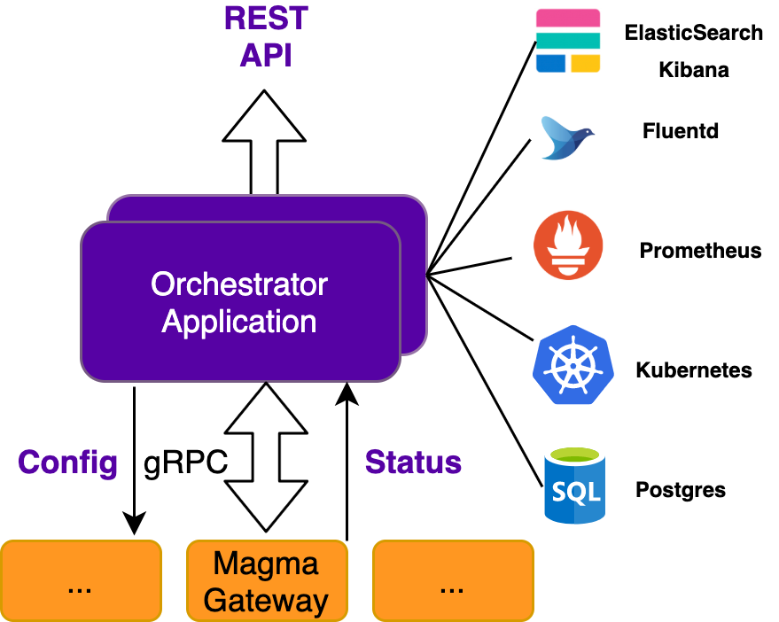
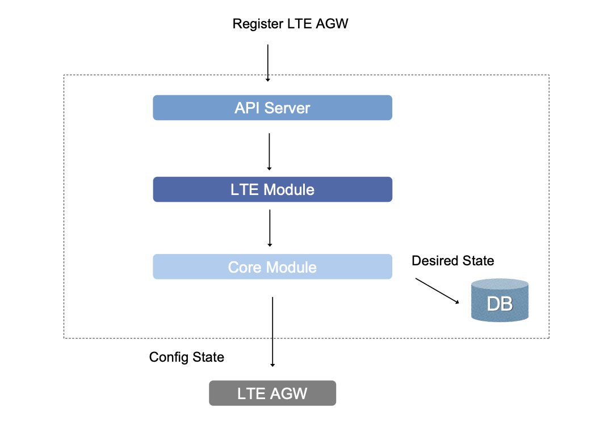

## Chapter 3 Overview and Learning Objectives

This chapter will give you greater familiarity with the Orchestrator component of Magma. The Orchestrator is the **central point for configuration input and monitoring** of status of a Magma deployment. Whereas a traditional 3GPP deployment requires the management of individual network elements, the Orchestrator provides a **network-wide view** of configuration and status.

By the end of this chapter you should:

* Know the main functions of the Orchestrator component.
* Understand how the Orchestrator interacts with the rest of Magma.
* Understand how the Orchestrator interacts with a variety of external components to support functions such as logging and metrics gathering (the functions referred to as FCAPS–fault, configuration, accounting, performance, security).

## Orchestrator Overview

The diagram below illustrates the following aspects of the Orchestrator:

* It incorporates functions provided by a range of existing open source components, shown on the right (ElasticSearch Kibana, Fluentd, etc.).
* It communicates using **gRPC** with the Access and Federation Gateways.
* It exposes a **northbound REST API** for management and configuration.

The Orchestrator is **implemented as a cloud service**, on either a public or private cloud.

Orchestrator and its main interfaces (retrieved from [Magma documentation](https://docs.magmacore.org/docs/assets/orc8r/orc8r_overview.png))

Note that the Orchestrator communicates with Magma gateways over gRPC. This communication is bidirectional, with the Orchestrator sending configuration information to gateways and the gateways in turn reporting up status, metrics, events, etc. "Gateways" in this case can include both Access Gateways (of which there may be many) and Federation Gateways (of which there are typically only one or two.)

## Orchestrator Functions

The Orchestrator supports the following functionality:

* Network entity configuration (networks, access gateways, federation gateways, subscribers, policies, etc.)
* Metrics querying (via integration with Prometheus and Grafana)
* Event and log aggregation (via integration with Fluentd and Elasticsearch Kibana)
* Device state reporting (metrics and status).

Note that all of these functions are **centralized**; no matter how many radio access points (eNodeBs, etc.) and Access Gateways (AGWs) have been deployed, both configuration and monitoring can be done from a central API provided by the Orchestrator. This is one of the main operational advantages of Magma over a traditional 3GPP implementation. In most 3GPP implementations, there has to be configuration of individual components, whereas Magma centralizes such configuration in the Orchestrator. Thus, whether one is adding a new AGW or a new subscriber, it can all be done via the one API. In other words, the Orchestrator abstracts the management of individual devices, presenting a network-level view to the operator.

All Orchestrator functions are accessed via the REST API, which means they can either be accessed using the NMS (which runs on top of that API) or can be integrated into other systems (such as existing operational dashboards or operations support systems.) We will revisit the NMS in Chapter 6.

## FCAPS (Fault, Configuration, Accounting, Performance, Security)

FCAPS is the term used in the telco industry to describe a wide range of functions related to management of the network. While network management is often treated as something of an afterthought in the enterprise networking world, it is absolutely essential in a telco environment. For example, it is important to be able to diagnose an issue when a user isn’t getting the service they expect, or to raise an alert if a device has entered a state that will soon impact performance for some users. In the following sections we will see how the Orchestrator addresses several of these aspects of network management.

## Orchestrator Architecture

The Orchestrator is modular and extensible. This modularity allows operators to deploy only the services needed for their specific use case. For example, it is possible to install the Orchestrator with or without the **metrics** module. There are also modules related to specific features in the network, such as certain radio access technologies, which can be deployed as needed. Over time, the number of available modules will increase. As discussed in more detail next, many of the technology-independent aspects of Magma, such as metrics, alerts, logging, etc., are provided by existing open source components that are integrated with the orchestrator.

Core Orchestrator services provide `domain-agnostic` implementations of the functionality described in the prior section. Technology-specific modules, such as **lte**, provide domain-specific knowledge to the core services. This modularity allows Orchestrator to remain flexible to new use cases while following the design principle that the mobile core should be, as far as possible, agnostic to technology-specific details.

The modular architecture of the Orchestrator is implemented using a service mesh approach. In short, this means that each module is implemented as a microservice that can be scaled out independently of others. Service mesh is a common design pattern in cloud native applications that provides capabilities such as:

* Fine-grained security applied to communication among services.
* Traffic management among services.
* Tracing, monitoring, logging of communication among services.

For more information on service mesh architecture, [this blog post](https://blogs.vmware.com/networkvirtualization/2019/07/service-mesh-networking-for-modern-applications.html/) provides a useful starting point. You can also see how the concept of a mesh of services is used in 3GPP in the [Architecture section](https://5g.systemsapproach.org/arch.html#mobile-core) of 5G Mobile Networks: A Systems Approach.

## Configuration Example

As an example, suppose the operator wants to configure a new AGW that supports LTE functionality. This would be initiated via a REST API call to the Orchestrator. That API call could be generated either by the NMS or by another system such as the operator’s OSS. The API request would be directed to the LTE module (since it is an LTE-specific function). The desired state is updated to reflect the fact that the new AGW should be registered, and a set of configuration information is generated and passed to the relevant AGW to implement the state. This sequence of events is depicted below.

Example of configuration of new AGW by the Orchestrator

## State Checkpointing

In addition to being the repository for desired state, which is driven by configuration inputs, the Orchestrator also maintains a store of the runtime state collected from each of the AGWs that it supports. This state includes such information as the set of UEs that is currently active and associated with a given AGW. The "state service" within the orchestrator maintains this information, so that other components of the Orchestrator can leverage the checkpointed state for various tasks, such as forwarding a message to an appropriate AGW based on current location of a UE.

By keeping this state in the central repository, the Orchestrator supports the following capabilities:

* Requests that originate from a federated network can be correctly forwarded to the appropriate AGW based on the UE location;
* If a UE moves from one AGW to another, its relevant state can be transferred to the new AGW for mobility support;
* In the future, high availability of AGWs can be built using this checkpointed state.

## Metrics and Monitoring

Supporting the collection of metrics and providing ways to query them is a key function of the Orchestrator. As an example, Magma can provide basic usage-based monitoring of subscribers (part of the Accounting aspect of FCAPS). While usage-based billing is common in traditional mobile networks, an important aspect in some Magma use cases is simply to ensure that usage is somewhat evenly shared among a set of subscribers. This is sometimes referred to as a "noisy neighbor" issue–the desire to ensure that one very heavy subscriber doesn’t interfere with the experience of others.

Metrics are generated by gateway components and reported up to the Orchestrator for storage and analysis.

Magma integrates with the open source component [Prometheus](https://prometheus.io/) to store metrics in a time-series database. It also integrates with [Grafana](https://grafana.com/docs), another open source component, to support visualization and analytics on the collected data.

## Events and Logging

Magma is extensively instrumented for troubleshooting and debugging purposes. Events capture rich, searchable data pertaining to the gateways, and entities tracked by the gateways. Events will evolve over time as the system capabilities become richer. Examples of events that can be traced include the following:

* Subscriber session tracing
* Subscriber data usage and bearer creation
* Gateway connection status
* eNodeB status tracing
* New gateway configurations pushed.

The Orchestrator uses [Fluentd](https://www.fluentd.org/) for storage of the underlying data for event tracing. [Elasticsearch Kibana](https://www.elastic.co/kibana) is used to support querying of the data.

## Security

The Orchestrator relies on TLS (transport layer security) to secure communication between clients and the API, and between gateways and the Orchestrator. In most cases, the connection is mutually validated, ie., both the client and the server use certificates to authenticate themselves to the other party. One exception is explained below.

Once authenticated, a client certificate is converted to a set of trusted metadata. From there, individual services can make application-level decisions on access enforcement by querying this metadata. The Orchestrator includes a service (known as accessd) to support such queries.

For the northbound API, requests must include a provisioned client certificate. This certificate can be generated using the **Orchestrator CLI** (command line interface).

The one exception to client-validated endpoints is the southbound bootstrapper endpoint. The Orchestrator provides a mechanism for registered gateways to securely bootstrap their authentication process via an open (server-validated only) service endpoint granting access to the bootstrapper service. This endpoint allows gateways to periodically refresh their session certificates, which then grant access to the full southbound interface.

For further information on Magma security and the gateway bootstrapping process, see the [Security section of the Magma documentation](https://docs.magmacore.org/docs/orc8r/dev_security).

## Chapter 3 Summary

In this chapter, we have walked through the primary functions of the Orchestrator. It is a central point of management and control for a mobile core. The Orchestrator exposes a REST API northbound that allows all monitoring and configuration tasks to be accessed centrally. It communicates with gateways using gRPC. The centralization of control and management is one of the main operational advantages of Magma over a traditional 3GPP implementation.