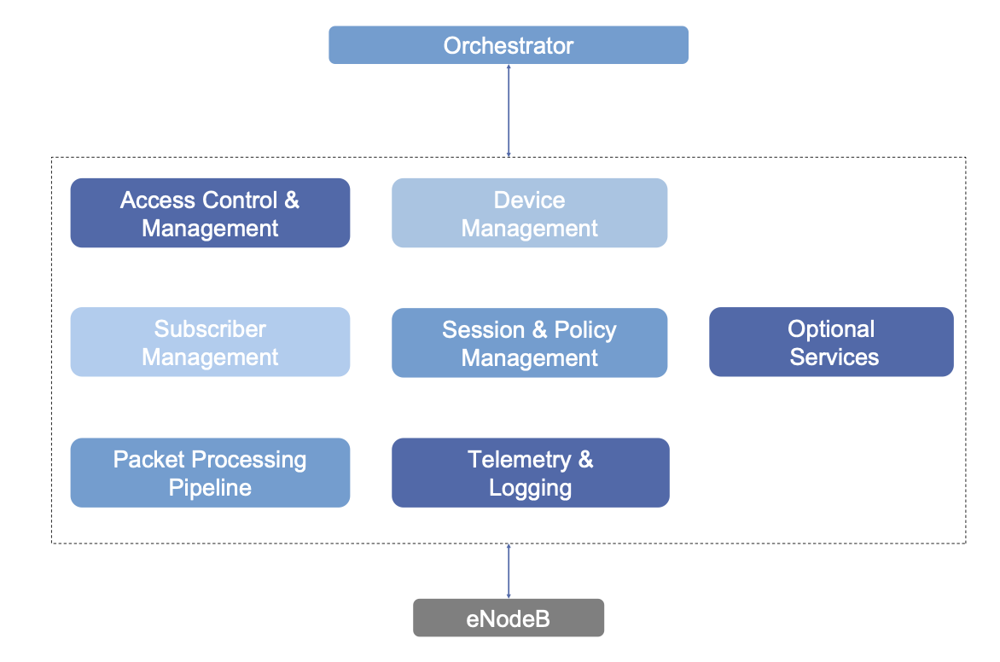

## Chapter 4 Overview and Learning Objectives

This chapter will give you greater familiarity with the Access Gateway (AGW) component of Magma. The AGW has a modular design consistent with the overall approach of Magma. The chapter walks through the major modules and their functionality.

By the end of this chapter you should:

* Understand the main functions of the Access Gateway component.
* Understand how the AGW interacts with the rest of Magma.
* Understand how the AGW differs from a traditional 3GPP mobile core implementation.

## AGW Architecture

The following diagram illustrates the major functional blocks of the Access Gateway. The modular design allows radio-technology-specific details to be limited to a few specific modules. The modularity also supports the objective of improving availability and upgradeability by maintaining small fault domains. Each module can be independently upgraded and restarted.

Major Functional Blocks of the Access Gateway

As noted previously, each AGW is connected to an Orchestrator, which provides centralized configuration and API access, and implements the centralized control plane. The AGW contains all the runtime state that is associated with active UEs (both user plane and control plane). In this figure, the AGW is shown connecting to a single eNodeB (a radio access base station), but in practice, several eNodeBs may be connected to a single AGW. Furthermore, the AGW can support multiple wireless technologies, including 5G/4G/LTE, as well as WiFi and CBRS (Citizens Broadband Radio Service). In cases other than 4G/LTE, the radio base station is something other than an eNodeB (e.g., gNodeB in the case of 5G).

Communication between Orchestrator and AGW uses gRPC. Likewise, the inter-module communication inside the AGW uses gRPC. The interface to the eNodeB (or other base station type) is standardized by 3GPP and thus conforms to the relevant interface specifications.

All stateful services in the AGW write their in-memory state to a **key value** store that is currently **Redis**. On startup, services read their runtime state from the state store and propagate the necessary side effects to other services using set GRPC interfaces. Making services stateless and state reconciliation simple allows Magma services to be resilient to software issues like crashes. There is work in progress to leverage this platform benefit to deliver hitless software updates that involves upgrading and restarting the service binaries.

In the following sections we will go deeper into the various components of the AGW.

The functional blocks of the AGW are further described in the [Magma Documentation](https://docs.magmacore.org/docs/next/lte/architecture_overview).

## Device Management

Device management entails two main components:

* Management of the AGW itself
* Management of RAN equipment such as eNodeBs.

The management of the AGW is independent of radio technology and entails:

* Ensuring that all component services of the AGW are active and healthy
* Collecting and reporting to the Orchestrator the metrics of the other services.
* Communication with the Orchestrator to bootstrap AGWs.

There is a technology-specific module within device management that knows how to communicate using standardized management protocols with a specific type of RAN equipment, e.g., an eNodeB in the case of 4G/LTE. This enables a collection of RAN equipment to be managed and configured centrally by the Orchestrator. Modules can be added as needed to support a diverse range of radio access technologies without changing the rest of the AGW system.

This highlights two key differences between the Magma design and traditional 3GPP implementations:

* A set of eNodeBs (or other base stations) can be centrally managed from one interface (the Orchestrator)
* The implementation is largely independent of the radio access technology (4G/LTE/5G or others such as WiFi). Only a specific module within the AGW is aware of the radio technology and knows how to communicate with the appropriate protocols to the base station.

## Access Control and Management

The access control component of the AGW performs authentication of UEs when they become active and establishes a secure data path from the UE to the data plane components of the mobile core (the SGW and PGW in the case of 4G/LTE networks). It roughly corresponds to the MME in a 4G network (see Chapter 1) or the AMF in a 5G network.

It is necessary to access a subscriber database to perform these functions (e.g., to verify that a particular subscriber is authorized to access the network, to obtain key material for authentication, etc.). This can either be accomplished by communicating with the HSS (Home Subscriber Service) in a federated network, or using the local subscriber database described in the following section.

## Subscriber Management

The subscriber management function effectively provides a local store of subscriber information equivalent to that stored in the Home Subscriber Service (HSS) of a standard 3GPP deployment. If the Magma deployment is federated with an existing MNO network, then there is no need for the local subscriber management. When the AGW is operating without federation, the subscriber management function stores information related to subscriber profiles, which is provided to it by the Orchestrator. It then services requests for this information from the access control component described previously.

## Session and Policy Management

Whenever a UE attaches to the mobile core, it is necessary to apply the appropriate policies to the session that is established. For example, a subscriber might be entitled to a certain data rate or quality of service (QoS), and these parameters can change over time, e.g. based on recent data usage by the subscriber. To implement these policies, the Orchestrator feeds policy rules to the policy database in the AGW. To enforce the policies, the session management component provides information to the data plane so that QoS policies, rate limits, etc., can be appropriately programmed into the data plane and enforced.

## Data Plane (Packet Processing Pipeline)

The data plane of Magma is implemented using a programmable forwarding model. The implementation is based on Open vSwitch (OVS). As described previously, it may be necessary to enforce a range of policies on data traffic as it passes through the AGW; this enforcement is provided by OVS based on forwarding rules that have been provided from the session and policy management component. The packet processing pipeline can enforce rules at various protocol layers (L2-L7) using deep packet inspection (DPI) if necessary for the higher layers.

There is a wealth of information on [Open vSwitch](http://www.openvswitch.org/) on its website.

## Telemetry and Logging

The AGW is instrumented with considerable telemetry to assist in monitoring and troubleshooting. Events can be collected and passed to the Orchestrator for subsequent analysis as discussed in Chapter 3. Examples include:

* Events related to general access gateway function (e.g. services restarted)
* Events related to subscriber sessions (e.g. session started/ended)
* Events related to MME function (e.g. subscriber attach/detach).

There is also a call tracing capability that is used to capture control packets flowing between a radio access point and an AGW for troubleshooting purposes. This service is invoked via the Orchestrator’s API, with the Orchestrator then passing the request to the tracing module in the AGW.

## Optional Services

Optional services include a facility to monitor the liveness of CPE (customer-premises equipment) equipment connected to the Magma service using ping, and reporting this back to the Orchestrator.

## Chapter 4 Summary

In this chapter, we have walked through the main functions of the Access Gateway. The AGW implements the User Plane and some aspects of the Control Plane of a Mobile Core. It operates under the control of an Orchestrator and is responsible for one or more base stations. It is agnostic to the particular radio access technologies. It uses a modular architecture, with a small number of the modules being specific to a certain technology (e.g., an eNodeB module services). Thus, the AGW architecture achieves the following goals of Magma:

* Heterogeneity
  Diverse radio access technologies are supported without impact to most of the architecture.
* Network level management
  Many base stations can be managed from a single point (the Orchestrator API).
* Small fault domains
  Individual modules in the AGW can be upgraded or restarted independently.