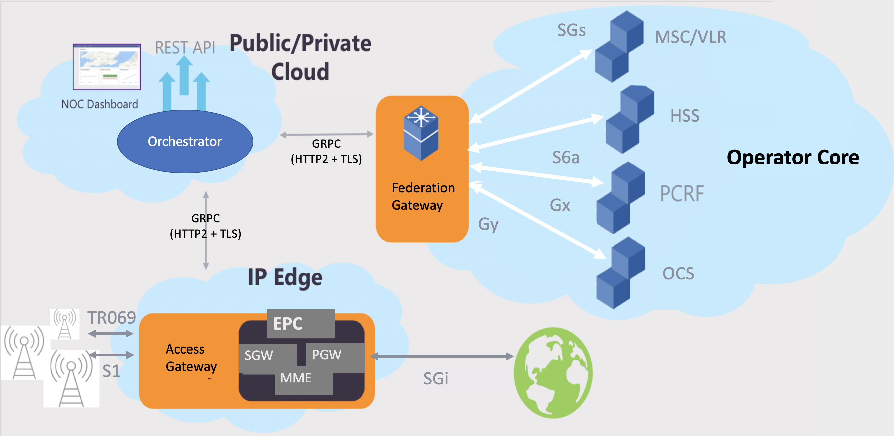

## Chapter 5 Overview and Learning Objectives

This chapter will give you greater familiarity with the Federation Gateway (FEG) component of Magma. **The FEG is the interface between Magma and the "standard" 3GPP world**. The Federation Gateway integrates a Mobile Network Operator’s (MNO) core network with Magma by using standard 3GPP interfaces to existing MNO components. It acts as a proxy between Magma and the operator's network. This enables core functions, such as authentication, data plans, policy enforcement, and charging to be uniform between an existing MNO network and the expanded network with Magma.

By the end of this chapter you should:

* Know the main functions of the Federation Gateway component.
* Understand how the FEG interacts with the rest of Magma.
* Understand the use cases for federation.

## Federation Gateway Overview

The role of the Federation Gateway in Magma can be best understood by looking again at the overall Magma architecture diagram.

**Magma High-Level Architecture** (retrieved from the [Magma documentation](https://docs.magmacore.org/docs/assets/magma_overview.png))

A simple way to think about the FEG is as a proxy: on one side it speaks **3GPP** protocols (SGs, S6a, etc.) and on the other it speaks **GRPC**.

There are some similarities between the FEG and the AGW, but also important differences. Both operate under the control of the Orchestrator. The FEG handles control plane connections to the operator core, while the AGW handles control plane connections to the RAN. Unlike the AGW, however, the FEG does not carry User Plane traffic. There are also typically only two FEGs (for high availability), as this is sufficient for the control plane traffic load. By contrast, dozens or more AGWs are needed to support a large scale network.

## Communication among AGWs and FEGs

Note that there are gRPC paths between the Orchestrator and the FEG, and between the Orchestrator and the AGW, but there is no direct connection between an AGW and an FEG. This is because there are typically multiple AGWs and FEGs, so the Orchestrator maintains the global mapping state necessary to determine, for any given communication, which AGW or FEG should be the target for a particular communication. This avoids the need for FEGs and AGWs to maintain state about each other. It also minimizes the number of connection points into the operator’s core network, as only the FEG needs a direct network connection to the federated mobile core.

Whenever a message needs to be sent from an AGW to an FEG or vice versa, the message is sent to the relay service within the Orchestrator. In the case where a request has to be relayed to an FEG, the Orchestrator determines the appropriate FEG based on the destination network and will forward requests to the FEG. In the FEG->AGW direction, the directoryd service (described in the previous chapter) holds the necessary mapping of UEs to AGWs so that the appropriate AGW can be selected. Once this mapping is determined, the relay service is again used to forward the requests.

## High Availability

While the Magma architecture diagram on the previous page shows only a single FEG, it is common to have a pair of FEGs in an active/standby configuration to provide high availability. Each gateway reports its health status to the Orchestrator. Health consists of real-time system and service metrics, such as service availability, request failure percentage, and CPU utilization. The Orchestrator maintains a global view of all Federation Gateway health and is responsible for setting which gateway is active and for routing traffic to that gateway. A Federation Gateway does not store persistent state, and a standby gateway can quickly be promoted to active during failover events.

## Federation Gateway Main Functions

The Federation Gateway supports communication between the Magma deployment and the following components running standard 3GPP protocols in the federated network:

* Home Subscriber Server (HSS) using the S6a interface.
* Policy & Charging Rules Function (PCRF) using the Gx interface.
* Online Charging System (OCS) using the Gy interface.
* Mobile Switching Center/Visitor Location Register (MSC/VLR) using the SGs interface.

The following sections explore each of these in more detail. For each of these components there is a standard 3GPP protocol for communication between that component and the FEG. If you are familiar with 3GPP standards, the rest of this chapter will be largely a review of standard 3GPP protocols as implemented by the FEG.

## Home Subscriber Server (HSS)

The Home Subscriber Server holds information about subscribers and is accessed by the MME to authenticate and authorize UEs. The standard 3GPP interface between the MME and the HSS is the S6a interface. Thus, when a UE attempts to associate itself with an AGW in a federated Magma deployment, the MME component of the AGW will need to issue requests to the HSS in the federated network. These requests, sent as gRPC messages to the Orchestrator, are relayed to the FEG, and the FEG forms the necessary S6a protocol messages to query the HSS. The response is received by the FEG, which then forms the appropriate response in gRPC and sends the response to the Orchestrator to be relayed back to the AGW.

While the above may seem convoluted, it ensures that:

* Precise details of the federated network are isolated from the AGW and the Orchestrator. Only the FEG needs detailed knowledge of the 3GPP protocols and procedures implemented in the federated network.
* Scaling out the system with more AGWs or more FEGs does not impose additional burden on the AGWs and FEGs.

Similar processes play out in the other functions supported by the FEG.

## Policy & Charging Rules Function (PCRF)

You may recall from Chapter 1 that the PCRF tracks and manages policy rules and records billing data on subscriber traffic. For example, a subscriber might be entitled to a certain data rate or quality of service (QoS), and these parameters can change over time, e.g. based on recent data usage by the subscriber. As noted in Chapter 3, the Orchestrator feeds policy rules to the local policy database in the AGW.

In the case of a federated deployment, the PCRF can be provided by the federated network. In this case, the FEG provides the standard interface to the PCRF via the Gx interface defined by 3GPP.

As in the previous section, the FEG converts between 3GPP protocol messages and gRPC messages, and communicates with the Orchestrator which in turn relays communications to and from the AGW.

## Online Charging System (OCS)

The Online Charging System is a component of the 3GPP architecture that tracks usage by a subscriber for billing purposes. It is "online" in that it may be consulted in real time to determine, for example, if a user still has enough credit to keep sending data. Just as for the PCRF, the FEG provides the standard interface to the PCRF–in this case, via the Gy interface defined by 3GPP. As in the previous section, the FEG converts between 3GPP protocol messages and gRPC messages, and communicates with the Orchestrator which in turn relays communications to and from the AGW.

## Mobile Switching Center/Visitor Location Register (MSC/VLR)

The visitor location register is roughly analogous to the HSS, except that it holds information for subscribers that have roamed into the network, rather than those for whom this is their home network. The VLR is populated with information that is retrieved from the home network of the subscriber. The FEG acts as a proxy between the Magma deployment and the VLR.

## Chapter 5 Summary

In this chapter, we have walked through the main functions of the Federation Gateway. The FEG operates as a proxy between the standard 3GPP interfaces of an existing Mobile Network Operator’s (MNO) network and a Magma deployment. It communicates directly with the Orchestrator, which in turn relays messages to and from the appropriate AGWs. By isolating the details of the 3GPP interfaces to the FEG, it ensures that the majority of the Magma implementation is independent of the details of the 3GPP protocols and the specific details of the federated network. The FEG meets the goal of allowing an existing MNO’s network to be extended by Magma (e.g. to increase coverage or reach remote areas) while maintaining a consistent view of subscribers, policies, and billing data.