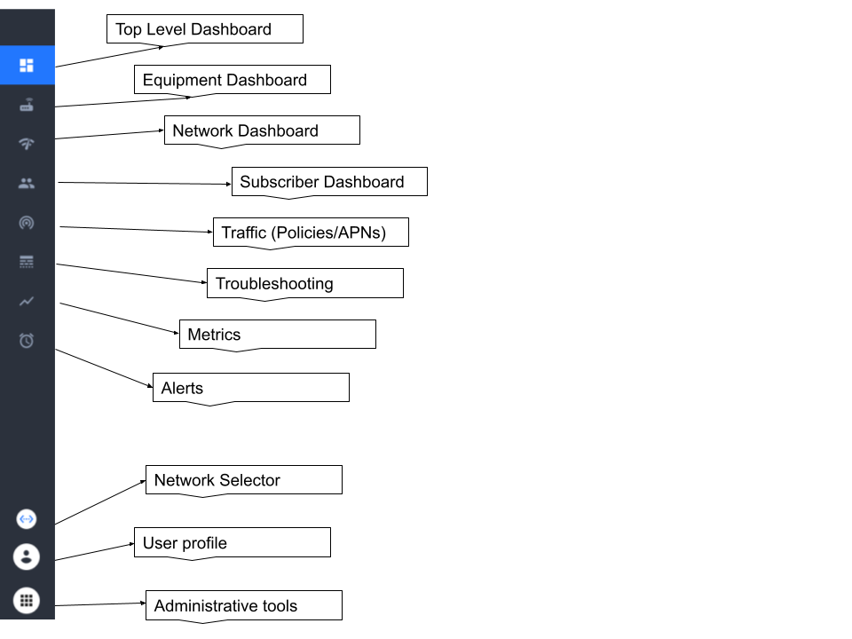
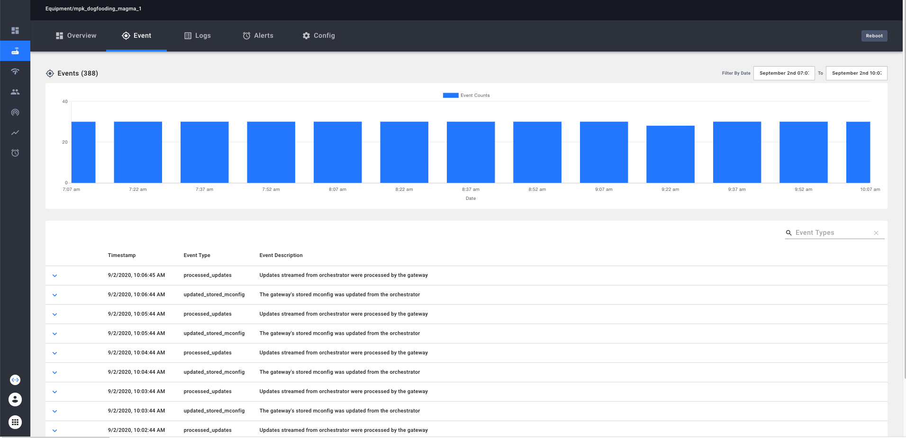
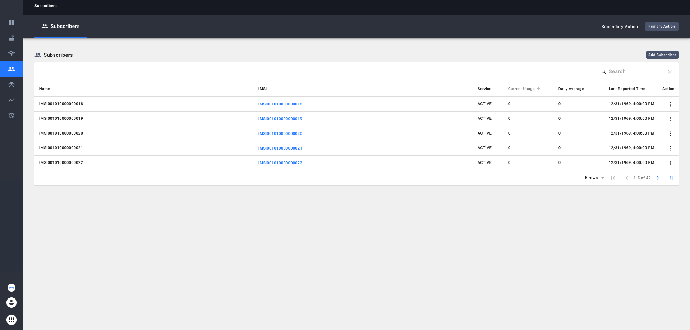
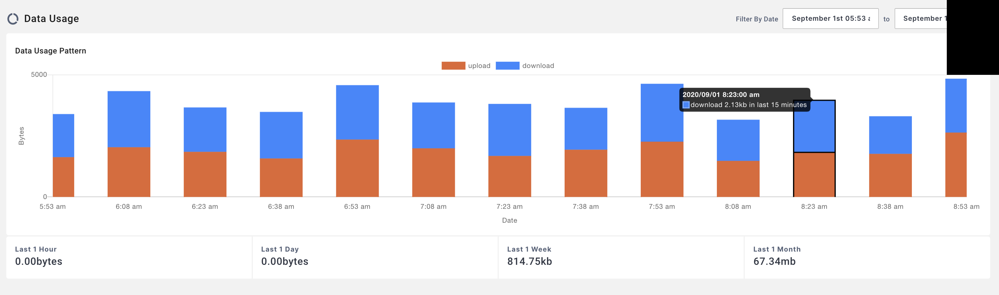
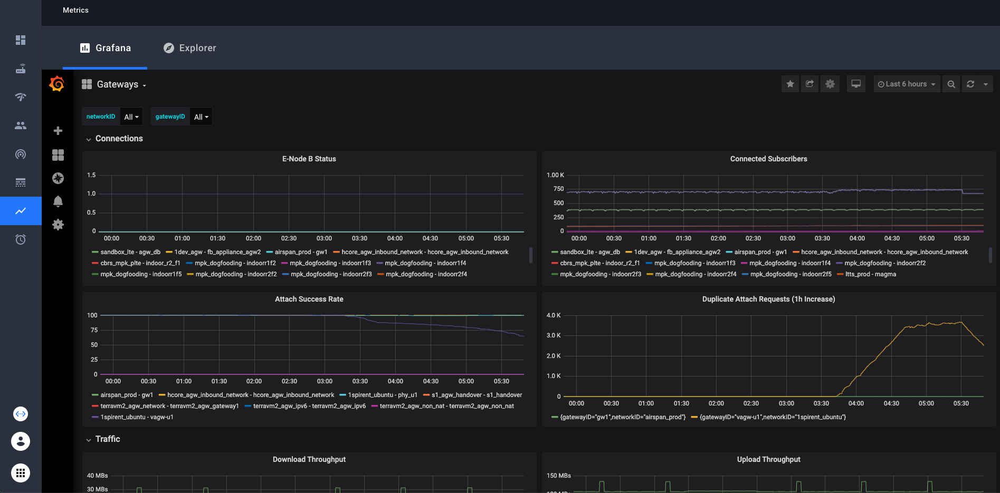
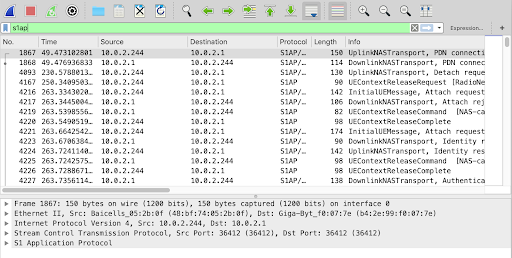

## Chapter 6 Overview and Learning Objectives

This chapter will give you greater familiarity with the Network Management System (NMS) for Magma. Almost every function in Magma is accessed via the REST API exposed by the Orchestrator. The Network Management System (NMS) provides a graphical user interface (GUI) that sits on top of that API, so that an operator can interact with Magma without needing to develop their own system to consume the API. In this chapter, we will look at the main functions supported by the NMS. Much of this content will illustrate concepts introduced in the prior chapters.

The most relevant background for this section is the [Magma documentation for NMS](https://docs.magmacore.org/docs/nms/overview).

If you want to get hands-on experience with the NMS, you can install a minimal Magma configuration including the NMS following the [Quick-start Guide](https://docs.magmacore.org/docs/basics/quick_start_guide).

By the end of this chapter you should:

* Know the main functions of the NMS.
* Understand how the NMS interacts with the rest of Magma.

## Rationale for the Network Management System

For established Mobile Network Operators, it is likely that they will have existing provisioning and management systems (OSS/BSS) that need to be connected to Magma, and this can be achieved by a combination of:

* Federating the existing network with Magma using the Federation Gateway; and
* Integrating the OSS/BSS with Magma using the REST API exposed by the Orchestrator.

However, it will often be the case that an operator needs to interact with a Magma deployment directly, and the NMS provides a way to do that. The NMS provides a GUI that is implemented on top of the REST API of the Orchestrator. This can be used to access features that might not be supported by the existing OSS/BSS, or can be used in greenfield deployments where no other OSS/BSS exists.

## Network Management System Overview

The Magma NMS provides a GUI for provisioning and operating Magma-based networks. It enables operators to create and manage:

* Organizations
* Networks
* Gateways and eNodeBs
* Subscribers
* Policies
* APNs (Access Point Names).

It also aims to simplify the operation of Magma networks by providing:

* A dashboard of all access gateways and top-level status to determine overall health of infrastructure components at a glance.
* KPIs (key performance indicators) and status of a specific access gateway to triage potential infrastructure issues that might need further investigation.
* A dashboard of all subscribers and their top-level status to determine the overall health of the delivered service at a glance.
* KPIs and service status of an individual subscriber to triage issues reported by that subscriber.
* Alerts displayed on the dashboard to escalate/remediate issues.
* Fault remediation procedures, including the ability to remotely reboot gateways.
* The ability to remotely perform gateway software upgrades.
* A way to configure and download call traces.

## Federated Operations

Note that when a Magma network is federated with an existing mobile network, configuration performed in the federated network is visible in the NMS. For example, a subscriber profile can be created in the existing network and then viewed in the Magma NMS. Thus, while the Magma NMS can create subscriber records and perform other configuration tasks, in the federated case, it may only be used to view configurations created in the federated network. The NMS also supports adding and configuring the federation gateways themselves.

## Dashboards Overview

The main screen of the NMS is depicted below, showing the main functions supported by a set of buttons along the left side. We will discuss these functions in more detail in the following sections.

Main Screen of NMS

The top-level dashboard provides summary information such as:

* Frequency of alerts and events over time.
* Alert table displaying 'Critical', 'Major', 'Minor' and 'Misc' alerts.
* KPI metrics across all gateways and eNodeBs.
* Total number of "healthy" and "unhealthy" gateways (based on checkins).
* Total number of eNodeBs, and the number currently transmitting.
* Network-wide event table.

For more detail, the operator can drill into one of the specific dashboards described next.

**NOTE**: The functionality of the NMS will clearly evolve over time as new orchestrator APIs are added, new wireless access technologies are supported, and more features are added to Magma. This chapter necessarily gives only a high level overview; the [online Magma documentation](https://docs.magmacore.org/docs/nms/overview) should be considered authoritative.

## Equipment Dashboard

The equipment dashboard covers the infrastructure components of a Magma deployment, i.e., Access Gateways and eNodeBs. For both AGWs and eNodeBs, the dashboard shows status (such as health stats) and provides options to configure and upgrade the relevant device.

## Equipment Dashboard: The Gateway Page

Specifically, the Gateway page allows an operator to view:

* "Checkin events" as a visible indication of the health and connectivity of each gateway.
* Gateway specific KPIs including Max, Min and Average latency of the pings to a specific destination and the percentage of healthy gateways.
* Details of each gateway such as its name, hardware ID, etc.
* Number of eNodeBs connected to each gateway.
* List of subscribers connected to a specific gateway.
* A searchable table of events that have been recorded by the gateway and a graphical representation of events frequency.
* A searchable table of log messages and a graphical representation of log message frequency.
* A table of alerts.

The image below (retrieved from [Magma documentation](https://docs.magmacore.org/docs/nms/equipment#gateway-dashboard)) shows an example of the Equipment Dashboard on the Events page:

The gateway page also allows an operator to configure an AGW, to add or delete an AGW, and to upgrade its software.

## Equipment Dashboard: eNodeB Page

The eNodeB page allows an operator to view:

* Total throughput of traffic through the set of eNodeBs.
* Summary health status of eNodeBs.
* Details of each eNodeB, such as its name, hardware ID, hardware configuration, etc.

It is also possible to add, edit, and delete eNodeBs.

## Network Dashboard

In the context of a mobile core, a "network" can be defined as a collection of RAN and EPC resources to deliver network services to a set of subscribers. Thus, a network has a set of properties such as a name, a MCC/MNC tuple (Mobile Country Code/Mobile Network Code), and a set of associated resources such as allocated bandwidth and radio channels in the RAN. These are quite specific to the particular radio access technology used. The network dashboard allows the operator to view the set of configured networks and to add new networks or edit the properties of existing ones.

## Subscriber Dashboard

The Subscriber dashboard provides a searchable list of all subscribers, some high level details on each one, and the ability to drill down on individual subscribers. It all supports the addition and deletion of subscribers. The overview page (retrieved from the [Magma documentation](https://magma.github.io/magma/docs/assets/nms/userguide/subscriber_overview1.png)) is shown below:

When an operator drills down on an individual subscriber, they see an overview of that subscriber’s status. This includes the recent data usage by the subscriber as shown below (retrieved from the [Magma documentation](https://docs.magmacore.org/docs/assets/nms/userguide/stacked_barchart.png)):

The dashboard also allows the operator to query events related to a subscriber, such as when sessions started and were terminated.

The subscriber dashboard can also be used to create, edit and delete subscriber records, with all the associated parameters for each subscriber. These include:

* Subscriber Name
* IMSI (the unique identifier for the subscriber)
* The subscriber’s secret key (Auth Key)
* The subscriber’s data plan
* The subscriber’s APN (Access Point Name - the data network to which the subscriber connects).

As noted previously, in a federated environment, the subscriber information comes from the operator’s existing mobile network, and the NMS simply allows that information to be viewed rather than created or edited.

## Traffic Dashboard

The name "traffic" might be a little confusing at first; it might more accurately be called the "Policies Dashboard". This dashboard displays the policies that are in place to control traffic (e.g. by rate limiting "noisy neighbors") and also the set of APNs (Access Point Names) that are configured to provide data services. This dashboard allows the operator to view the policies and APNs that are configured, to edit them, and to create and delete them.

Policies in the context of mobile networks include QoS profiles and filtering rules (e.g. to block traffic to certain IP addresses).

## Metrics

As discussed in Chapter 3, Magma is extensively instrumented so that metrics can be collected from almost every part of the system. Magma gateways and the Orchestrator generate metrics to provide visibility into gateways, base stations, subscribers, reliability, throughput, etc. These metrics are regularly pushed into the time-series database provided by Prometheus. Metrics can be queried and displayed in a variety of ways, and the NMS provides a dashboard for this purpose.

The dashboards to explore and view metrics are provided by Grafana, which is a full-featured analytics platform that allows a user to create custom dashboards. Magma comes with a few built-in dashboards such as the one illustrated below, which shows the eNodeB status, connected subscribers, and attach metrics for an AGW.

The full set of metrics supported by Magma will increase over time; the current set is documented here. For full documentation on Grafana and how to customize it, refer to the [Grafana documentation](https://grafana.com/docs/grafana/latest/dashboards/?pg=docs).

## Alerts

Alerts provide a means for operators to be notified of conditions in the network that require attention, such as faults of performance issues. Magma provides a set of built-in alerts, a way to customize alerts, and tools to direct alerts to other systems (e.g. Slack) so that appropriate notifications can be delivered and action taken to address issues. The NMS supports these operations.

Predefined alerts include:

* High CPU usage on a gateway
* Unsuccessful attachment attempts of a UE
* Authorization or authentication failures
* Exceptions when bootstrapping a gateway
* Service restarts.

Custom alerts can be configured using the metrics discussed above and comparing them to certain triggers, e.g. free memory less than a threshold, disk utilization above a threshold, etc.

## Call Tracing

Call tracing is an important troubleshooting tool made available by Magma, which can be initiated either from the NMS or the Orchestrator API. A call trace initiates packet capture on a particular interface of an AGW; the captured packets can then be downloaded and analyzed using a tool such as Wireshark. By inspecting the exchange of messages captured, it is possible to diagnose a range of problems that might affect subscribers connecting to and using the network. The figure below (retrieved from the Magma documentation) shows an example of a trace displayed in Wireshark.

Example of a trace displayed in Wireshark

## Chapter 6 Summary

In this chapter, we have walked through the main functions of the Network Management System (NMS). The NMS provides a basic OSS/BSS to operate a Magma network. In telco terminology, it supports the FCAPS (Fault, Configuration, Accounting, Performance, Security) functions. The NMS consumes the REST API provided by the Orchestrator. It gives the operator the ability to see alerts, monitor performance and other metrics, and configure all aspects of the Magma system, such as Gateways, eNodeBs (or, in the future, other radio equipment), subscribers and policies.